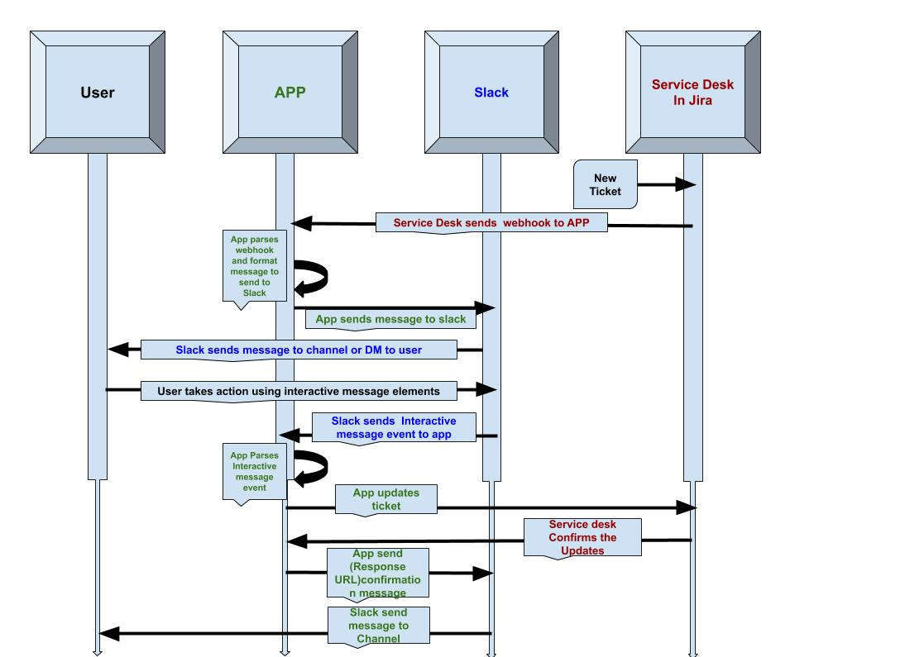

                                             App Architect and Development : Reihaneh Vafaei
                                            
                                             Email: Reihaneh.vafaei@nenetgroup.com 


## Jira Approval Application On SLACK

This Application is aimed to provide two ways connections between Jira and Slack.

## Main Features
The main feature of this application is to send a Direct Message to Someone who is responsible to
Approve/Reject a Jira Ticket request on Slack.


## Explanation of Files:

1: jira_Approval_App.py = Source code for the slack App.

2: config.json = Configuration File


## How to configure the jira_Approval_App:
 
 In order for this Slack App to work, It will need a few keys to authenticate to slack, the contents 
 of the config file as well as what they can be found below:


  {
  
  "slack_signing_secret" : "",
    
  "SLACK_VERIFICATION_TOKEN" : "",
    
  "slack_bot_token" : ""
  
  }

    
  However, to make these authentication code to be safe, the alternative way is to store all 
 your variables as shell variables that will be availbale to your running code or even
 better put all your secret/tokens in your .bash_profile then you source this
 file due to which these will be available to all your running processes via environment variables.
 
  In .bash_profile file you can open by Command ##nano .bash_profile on exact directory and export
 code like this:
 
```diff
+ export App_Token="##############################"

+ export SLACK_VERIFICATION_TOKEN="###############"
```

## Create a SlackClient for your bot to use for Web API requests:

In Source code you can set this os.environ to reach out the secret:

```diff
+ slack_bot_token = os.environ["App_Token"]

+ slack_signing_secret = os.environ["SLACK_SIGNING_SECRET"]

+ SLACK_VERIFICATION_TOKEN = os.environ["SLACK_VERIFICATION_TOKEN"]

```

## How to Run Locally:

  In order to run this App(Bot) locally you are first going to need a tunneling software set up and configured.
 First, when the Ticket is created in Jira, the Service Desk will send webhook to App, also when App posts Direct Message as Intercative Message to user in slack, 
 the slack event handler will send a message to your server.
 As you will be running this locally you will need a way to forward that request to your local host. For this example I have used **ngrok**.
 
 1. **In terminal session a, launch ngrok**
    
    ./ngrok http 5000
    
 
 2. **In terminal session b, launch the slack bot**
     
     pip3 install -r requirements.txt
     
     python3 jira_Approval_App.py
     
     
     
 3. **So Slack User will be get DM (Direcet Message) as Interactive message On Slack when new Ticket is 
    created and assigned user as Approver**
    
    
    
 ## Diagram



